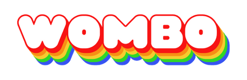

    <h1 align="center">Привет, меня зовут</h1>
    
    

        Я модуль для использования нейросети dream от компании wombo
    

    

        
    

    <h2 align="center">Документация</h2>
    

        
Генерация изображения

        ВАЖНО: После недавнего обновления, после создания экземпляра нужно обновлять токен с помощью Dream().auth._get_auth_key(). Если вы используете свой от аккаунта, это не требуется!
        

        

            
может принимать следующие параметры

            <ul style="list-style-type: disc; padding-left: 20px;">
            <li><strong>text:</strong> str</li>
            <li><strong>*style:</strong> int</li>
            <li><strong>*ratio:</strong> str</li>
            <li><strong>*premium:</strong> bool</li>
            <li><strong>*display_freq:</strong> int</li>
            <li><strong>*timeout:</strong> int</li>
            <li><strong>*check_for:</strong> int</li>
        </ul>
        

        <pre style="padding: 10px; border-radius: 5px; overflow: auto;">
from wombo.models import TaskModel
picture: TaskModel = dream.generate("anime waifu")
        </pre>
    

    

    

        
Профиль

        Этому разделу прекращена поддержка, но он рабочий. Смотрите в коде
    

    

        
Стили

        <pre>
from wombo.models import StylesModel, StyleModel
styles: = dream.styles.get_styles()
        </pre>
    

    

        
API

        

            ВАЖНО: После недавнего обновления, после создания экземпляра нужно обновлять токен с помощью Dream().auth._get_auth_key(). Если вы используете свой от аккаунта, это не требуется!
        

        

            
может принимать следующие параметры

            <ul style="list-style-type: disc; padding-left: 20px;">
            <li><strong>text:</strong> str</li>
            <li><strong>*style:</strong> int</li>
            <li><strong>*ratio:</strong> str</li>
            <li><strong>*premium:</strong> bool</li>
            <li><strong>*display_freq:</strong> int</li>
        </ul>
        

        <pre>
task: TaskModel = dream.api.create_task("anime waifu")
dream.api.check_task(task.id)
dream.api.tradingcard(task.id)
        </pre>
    

    

        
Скачать можно тут

        
    

    <h2 align="center">Разработчики</h2>
    

        <a href="https://gitverse.ru/sweetdogs" style="color: inherit; text-decoration: none; font-size: 18px; background-image: linear-gradient(to right,rgb(28, 245, 28),rgb(124, 124, 241)); -webkit-background-clip: text; -webkit-text-fill-color: transparent;">sweetdogs</a>
    

    

        <a href="https://github.com/mayn3r" style="color: inherit; text-decoration: none; font-size: 18px; background-image: linear-gradient(to right, #ff0033, #ff4da6); -webkit-background-clip: text; -webkit-text-fill-color: transparent;">mayn3r</a>
    

